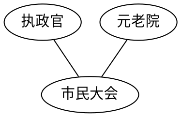
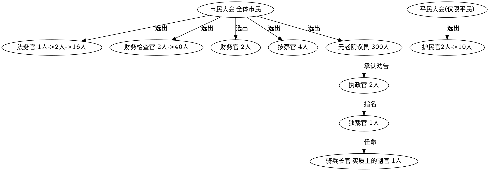

+++
title = "罗马不是一天建成的"
date = 2022-01-04T23:05:57
lastmod = 2022-02-26T11:52:34+08:00
tags = ["book", "history"]
categories = ["book"]
draft = false
toc = true
+++

根据传说, 罗马于公元前753年建国, 根据史实, 罗马于公元前270年完成了意大利半岛的统一

## 1 王政时代 {#王政时代}

### 1.1 建国之王罗穆路斯 {#建国之王罗穆路斯}

18岁的罗穆路斯, 带领3000名拉丁人, 定都罗马于台伯河东岸. 将国政分成三个机构, 分别是国玉, 元老院和市民大会, 并由这三方共同治理罗马. 就这一分权的举措, 就与东方帝国走上了不同的道路.

-   国王: 作为宗教祭祀, 军事和政治的最高领导人, 国王由市民大会投票选举产生
-   元老院: 由贵族长老组成, 其职责是向国王提出忠告与建议
-   市民大会: 由全体罗马市民组成, 它的任务是选出以国王为首的各级政府官员, 市民大会没有制定政策的权力, 但是对国王制定的政策有赞成或反对的表决权. 此外, 对外关系上, 是战是和, 也必须说征得他们的同意才可实施

### 1.2 第二代国王努马 {#第二代国王努马}

在适当的时候, 把适当的人放在适当的位置上施展才华的事例, 在各民族走向兴盛的历程中比比皆是. 而领导者政德不修, 让整个国家与民族走向衰頹, 也正在上演.

罗穆路斯死后就任的国王是努马, 历史学习李维在&lt;罗马史&gt;中关于努马的功绩是这样描述的:

> 就任王位后的努马, 试图对依靠武力和战争打下建国基础的罗马进行立法和习俗的改革.

这里所谓的立法改革, 不是要制定全新的法律, 而是要建立秩序, 要让当时逞强好胜的罗马人懂得做人的礼法. 在了解自身力量的局限性的同时, 让他们懂得要对超越自身极限心存畏惧.

努马认为除了为防御而战之外, 这一时期的罗马不需要战争. 他集中力量发展农业和畜牧业. 目的是在战争取得服务后, 即使不对失败者进行掠夺也能做到自给自足.(在2700年前, 有这样长远的眼光, 着实令人敬佩)

努马还对罗马市民进行了职业分工, 让每个人归属于有独立保护神的团体.

努马为了使人们的日常生活变得有序, 还进行了历法改革, 根据月亮的盈亏, 把一年分成12个月, 规定总天数为355天(而650年后, 恺撒才重新修正历法, 把一年总天数定为365天, 也就是今天依旧沿用的历法)

因为罗马是多神教, 努马还对这些神进行了整顿, 设立了等级制度, 让大家懂得尊重诸神的重要性(有信仰的确让人心存敬畏). 像犹太教, 基督教即是一神教, 即只允许有信仰一个神.

一神教和多神教的区别不只在于纯粹的神的数量, 还在于是否认同他人信奉的神. 认可他人的神, 意味着认可他人的存在.

希腊历史学家狄厄尼索斯在其著作&lt;古罗马史&gt;中说过这样的一句话:

> 使罗马强大起来的要因在于他们对宗教的见解之中

对罗马人来说, 宗教不是指导原理, 它只是精神寄托. 因为有宗教信仰, 人性不再受到禁锢. 想到在某个政党的统治下, 连信仰自由这样的自由都失去了.

和罗马人一样从不向神祈求纠正人类伦理道德的希腊人转而在哲学中探索真理. 因此:

> 向宗教寻求纠正人类行为准则的是犹太人
>
> 向哲学寻求纠正人类行为准则的是希腊人
>
> 向法律寻求纠正人类行为准则的是罗马人

### 1.3 第三代国王托里斯-奥斯蒂吕斯 {#第三代国王托里斯-奥斯蒂吕斯}

继努马之后, 登上王位的是托里斯-奥斯蒂吕斯. 他是拉丁系罗马人, 和罗穆路斯一样, 是个崇尚对外进攻的男人.

托里斯攻占了拉丁民族的发祥地, 阿鲁巴, 并将居民强行迁居罗马, 但给予他们罗马市民的身份, 吸纳他们成功罗马国民, 进一步壮大罗马.

托里斯率领罗马军队一次又一次出征, 取得比罗穆路斯还辉煌的军事战绩, 他的统治历时32年, 不过根据历史学家李维的说法, 他是死于雷劈.

### 1.4 第四代国王安库斯-马尔西乌斯 {#第四代国王安库斯-马尔西乌斯}

安库斯是努马的外孙, 成为国王后统治长达25年, 其中免不了挥军与罗马周围的部族战斗. 除了战斗, 他还完成了几件大事:

1.  在台伯河架起了第一座桥梁, 上的是把位于西岸的贾尼科洛山和集中在东岸的七个山丘联系起来
2.  他征服了位于台伯河河口的奥斯提亚, 为此罗马终于得以和地中海直接连通. 并在奥斯提亚周边的海滩发展制盐业, 为罗马人提供了不是流通货币的货币(

### 1.5 第五代国王塔克文-普里斯库斯 {#第五代国王塔克文-普里斯库斯}

塔克文, 一个来自伊特鲁里亚的移民, 在国王死后, 他毛遂自荐要竞选罗马国王, 大概是开展选举活动的第一个罗马人.

成为罗马第五代国王的塔克文显示出了他超强的领导能力. 在37年的统治期间, 不仅使罗马的势力范围得到进一步的扩张, 而且罗马内部也发生了巨大的改变, 同时市民的生活水平也得到极大的提升, 罗马一跃成为名副其实的罗马城邦.

他即位后做的第一件事情是增加元老院的人数, 自从罗穆路斯设立元老院以来, 人数一直维持在100人, 而塔克文将它增加到200人, 以此塞进自己的忠实支持者, 以稳固自己的权力

塔克文与前任国王们一样, 继续征战四方, 但战斗结束后, 他没有让战败者移民罗马, 而是给他们市民权, 继而同化他们.

他还开发罗马人居住的七个山丘之间的湿地, 挖掘下水渠, 构建大规模的下水道网络. 塔克文领导下的排水开垦事业不仅增加了可用土地资源, 而且也为罗马形成一体, 促进各民族之间的交流, 直到了不可磨灭的作用.

而后, 塔克文还在最高的卡匹托尔山丘建起神殿, 专门供奉罗马诸神中的最高神朱庇特神, 其他诸神也都各基所.

### 1.6 第六代国王塞尔维乌斯-图里乌斯 {#第六代国王塞尔维乌斯-图里乌斯}

在当时先王的排水开垦事业和朱庇特神殿建造工程完成之后, 作为先王女婿的国王塞尔维乌斯-图里乌斯的之急就是保卫全罗马的城墙建设.

这座城墙在经过了2500年后的今天依然叫"塞尔维乌斯城墙", 在现代罗马, 随处可见其断壁残垣.

在塞尔维乌斯成就的功绩中, 最重要的莫过于军队体制的改革. 他所进行的这一改革不仅涉及税制改革, 而且涉及选举制度的改革.

作为一个国民, 他所承担的义务一是缴纳税金, 二是保家卫国. 在古代, 很多国家都以服兵役的形式来抵直接税, 罗马如此, 希腊如此. 只有做到这一点的, 他才是独立的市民. 作为独立的市民, 自然会有相应的权利. 市民的权利就是投票权. 所以军队体制等于税制, 也等于选举制, 这一等式成立, 并且天衣无缝.

而2500年后, 仍然有某些国家, `只有缴纳税金的义务, 却没有选举的权利`.

另外, 罗马选举制实行的不是一人一票制, 而是按军团的最小单位, 每百人队一票. 百人队中的100个人首先要在内部进行讨论, 形成的统一意见就体现在这一票上. 其实, 它相当于小的选举区制.

看起来是否很熟悉, 个人感觉, 美国的选举人制度就是来借鉴自罗马的百人一票, 总统选举, 在某个州赢得50%的票, 就可以赢得全部选举人票.

### 1.7 最后一位国王: "傲慢者塔克文" {#最后一位国王-傲慢者塔克文}

当塞尔维乌斯执政44年之后, 野心勃勃的塔克文的孙子反叛国王, 与妻子, 即国王的女儿一起谋杀了国王. 并在国内实行独裁统治, 从来不向元老院征求任何意见或建议, 也从业不问市民大会同意与否, 因此市民在背后称其为"傲慢者塔克文"

在国内实行独裁统治地专制君主"傲慢者塔克文"在军事方面却表现出卓越的才能. 在与周边部族的战斗中, 罗马几乎都是常胜军.

在一个人强大的时候丑闻不会招惹你, 而一旦显出疲态, 丑闻将毫不留情地击垮你. 即使丑闻与你无关, 但是作为有效武器, 它的作用不可小觑.

国王有一个儿子叫塞克斯图斯, 看上了亲戚科拉提努斯的妻子琉克蕾西娅, 欲火中烧的年轻人乘琉克蕾西娅的丈夫不在家的夜里, 来到女人的家中, 用短剑相威胁, 占有了女人的身体.

当天夜里, 琉克蕾西娅就给在罗马的父亲和正在出征的丈夫分别送去一封信, 令其速归. 坐在床上沉浸在悲愤之中的琉克蕾西娅向赶来的父亲与丈夫及朋友说完事情的经过, 就拿出短刀刺向自己的胸膛, 她呼吸艰难地要在场所有男人发誓为她报仇后, 就永远地闭上了眼睛.

琉克蕾西娅的遗体被送到罗马, 放置在古罗马广场的演讲台上, 面对这一惨状, 人们纷纷指责国王和他一家的蛮横与傲慢. 因此有丈夫的朋友布鲁特斯向市民作出演讲, 历数国王的罪行, 提议将国王和他的家人逐出罗马. 市民纷纷云从.

"傲慢者塔克文"的统治持续了25年, 随着第七代国王塔克文的统治结束, 罗马的王政时代也宣告结束. 时间是公元前509年. 从罗穆路斯于公元前753建国到这一年, 罗马已经走过了244年.

## 2 共和时代 {#共和时代}

随后的罗马进入了共和政体, 迎来了执政官统治的时代. 和从前一样, 执政官也由市民大会选举产生, 任期由终身改为短短的一年, 还有, 原来由一位国王统治改由两位执政官共同治理.

在战时, 可以任命独裁官, 任期为6个月, 所有人需听从独裁官命令(包括执政官)

### 2.1 路奇乌斯-尤尼乌斯-布鲁特斯 {#路奇乌斯-尤尼乌斯-布鲁特斯}

巧妙利用丑闻推翻王政的最大功臣是路奇乌斯-尤尼乌斯-布鲁特斯. 他是随后延续500年的共和制罗马的创始人.

路奇乌斯-尤尼乌斯-布鲁特斯是历史上难得一见的, 兼具先见之明和行动力的人. 因为他的母亲是被逐出罗马的国王塔克文的姐妹, 所以他和国王是舅甥关系. "布鲁特斯"这个姓不是他的原姓, 而是他的外号, 意思为"傻瓜". 据说他在专横跋扈的塔克文时代, 一直隐忍着被蔑称为"傻瓜", 结果, 这个外号就成了他的姓氏.

他认为罗马已经长大, 完全可以废除效率很高却只受国王个人意志左右的王政制度. 他在与被放逐国王企图夺回罗马的一战中, 与国王之子, 表兄阿隆斯激战对决, 双双殞命.

### 2.2 "亲民者"瓦莱里乌斯 {#亲民者-瓦莱里乌斯}

共和政体的创立者布鲁特斯的壮烈牺牲让罗马人悲痛不已. 然而他们的眼泪未干, 就开始猜疑了幸存的执政官瓦莱里乌斯. 认为瓦莱里乌斯凯旋时所乘战车为四匹白马, 过于高调, 有炫耀王者风范的意思, 再者瓦莱里乌斯家里富有, 位置居市中心, 建筑气派, 像国王的居所.

瓦莱里乌斯为避流言, 连夜拆除自家的房子, 并于便宜地段建了简陋的房屋, 并向众人自由进出, 以示一心为公.

瓦莱里乌斯而后制定法律, 改善国政:

1.  制定有关国库的法律, 在王政时代, 国库由国王掌管, 现在则交由财务官管理. 作为政治军事最高权力者的执政不干预国家财政一法赢得了市民们的喝彩.
2.  制定了诉讼的法律: 凡是享有罗马市民权的人, 对法务官作出的判决有权向市民提起诉讼. 有点难以想象, 这是2500年前的法律, 着实体现出对人的权利的尊重. 它的制定, 为后世罗马留下了极其重要的法的概念
3.  过度在乎舆论而制定的一条法律: "凡是觊觎王位之人, 无论是谁, 其生命和财产将为诸神所有". 也就是说, 即使杀了人, 只要有证据证明被杀的人对王位有所企图, 就可以赦免杀人者. 证明企图这个本身就相当模糊, 就相当于在法律上开了个免除罪罚的口子.

在公元前509年至前503年的6年间, "亲民者"瓦莱里乌斯共当选了四届执政官, 因此期间实施的政策可以认为基本出自这位"亲民者":

盐收归国有: 过去奥斯提亚盐田出产的盐是由个人经营, "亲民者"经营权收了回来, 改由政府经营. 他试图通过这一改变, 来恢复因伊特鲁里亚人外流而日渐下滑的罗马经济. 当时罗马还没有流通货币, 盐在交易外国商品中充当了货币的角色. 相当于货币国有化.

如果改革仅此而已, 那么只能使用高价盐交易商品的商人对通商的兴趣就会大大减弱, 对恢复经济于事无补. 于是, "亲民间"降低了向他们征收的间接税, 因此还吸引了一些本不从商的人也开始纷纷从商(通过税收调整经济政策, 2500年前执政者都知道使用的手段, 某些国家, 就只会在经济下行的时候, 还加税)

"亲民者"非常欢迎外国人移民罗马, 在罗马邻近部族中, 有人说同属拉丁民族之间, 拥有相同语言和相同诸神的拉丁人之间相互争斗毫无意义. (可见, 罗马人是相当开放的, 并没有以血统论身份, 而是真的做到, 来了就是罗马人)

公元前503年, 罗马改为共和制已经6年了, 这一年, "亲民者"撒手人寰, 离世人而去, 此时的瓦莱里乌斯已经散尽万贯家财, 边丧葬费都拿不出来, 是每个罗马人自发捐款, 为"亲民者"举行了葬礼. 和布鲁特斯死时一样, 罗马女人像为父亲离世那样, 服丧一年

罗马共和政体由布鲁特斯播下种子, 又在"亲民者"的施政中深深扎下了根. 在这两人之后的罗马, 再也没有出现过试图复辟王政的人.

### 2.3 贵族与平民的对立 {#贵族与平民的对立}

在进行共和政体的罗马, 在其后的80年, 一直到公元前367年, 始终处于摇摆不定的不稳定状态, 贵族和平民之争一直没有得到有效的遏制. 造成这种情况的原因可以列举如下几个:

1.  归咎于农牧民族的罗马人自古以来的保守性格. 罗马人本能地厌恶改革, 即使璚非改革不可的时候, 进展也很缓慢. 一旦改革成功, 不会轻易改变.
2.  罗马贵族抗争的态度非常强硬, 并且, 罗马的贵族阶级拥有强大的力量, 足以和平民阶级一决高下.
3.  尽管罗马平民强烈要求少数人统治的政体下的机会均等, 但是他们并没有要求改变少数人统治的政体, 即寡头政治. 尽管他们要求授予自己的代表以统治的权力, 但是他们并没有要求让平民阶级的所有人都参与政权.

王政时期的罗马:



共和政体的罗马:



国王是终身制, 由市民大会选举产生, 经元老出家人确认同意, 一位国王只要在王位上坐上30-40年, 势必与元老院的关系变得很松散, 权力的独立性也会很高.

因为元老院的职责只剩下向国王提建议和劝告. 与此相反, 所有罗马市民都可以参加市民大会, 因为有权对国王行使的政治策略和军事行动投票赞成或反对. 因此, 国王政体的权力构造呈三足鼎立, 是非常稳定的.

进入共和政体的罗马, 权力构造发生了变化, 由两个执政官同时执政取代了以前的国王, 尽管可以多次当选, 但每次任期都是一年, 而年年选择两位执政官的, 就是各派势力首脑组成的团体--元老院. 于是, 执政官和元老院之间的距离自然是逐年缩短, 渐渐地, 三足中的两足出现重叠, 直至合二为一.

共和政体诞生之初的十几年里, 罗马不得不举国一致共同对外, 但是与此同时, 罗马的平民阶级也认识到自己的力量, 他们意识到, 没有他们的参战, 无何止的战斗既不能取胜也无法坚持下去.

几乎年年不断的战事使他们不得不长时间离开他们工作的农田, 牧场, 施工现场或商店, 直接导致平民阶级的经济状况越来越差. 另一方面, 贵族阶级有大片的农田, 牧场作后盾, 即使不劳动, 经济也不至于很快衰退.

对抗越演越烈, 平民甚至还有在参加战斗期间, 家里财产因负债被出售或没收的风险, 因此民愤激昂, 外敌来犯时, 再没有人响应执政官的号召, 一致对敌, 平民们固守在埃斯奎里山和阿文庭山，拒不出来, 这是罗马历史最早的罢工运动. 而后罗马市民又进行了第二次罢工运动

最终的结果是, 与贵族谈判后, 决定设立一个专门以保护平民阶级利益和权利为上的的职位, 这个职位叫护民官, 就任职位的必须是平民阶级出身. (这就是最早的, 用脚投票的结果, 权利不是别人施舍来的, 是自己争取来的). 护民官有权对执政官作出的决定行使否认权, 但限制时, 战时不得行使.

罗马军常年去外敌作战, 虽说不是无敌之师, 但基本都是罗马军占优势, 而问题恰出于此. 通常罗马在取得战斗胜利后, 不会把对方部族置于彻底的统治之下, 他们通常会接收战败方的部分"所有地", 把其中一半作为同盟国赢得的份额, 另一半留作自己的"公有地"出租给罗马市民.

围绕公有地的出租份额比例, 再次引起贵族与平民的对立, 平民阶级认为仅有地的出租公配偏向贵族阶级, 而贵族阶级则以尊重私有财产的法律为挡箭牌, 抵制平等分配. 并且, 肥沃的土地分配给贵族, 自己只能得到贫瘠的土地, 平民阶级反应强烈.

另外, 平民阶级提出要求法律的成文化: 法律只要还停留在口头约定上, 在执行时, 就容易偏向所有法律制定权势贵族阶级. 因此, 要求法律成文合情合理. 成文的法律谁都能看到, 执行起来就可以做到客观公允(所谓法不可知, 则威不可测, 这样的道理2000年前的罗马人都认识到了, 而在某些国家, 法律就制定得非常模糊, 方便政府解释, 造成群体普遍违法, 应政府需要, 选择性执法. 法律变成政府抓人的大网, 而某些发言人还能公言说出, 不要拿法律当挡箭牌这样的话.)

而后, 贵族应平民要求, 编写成文法&lt;十二表法&gt;, 又名十二铜表法, 因为它是一项一项刻在铜板上的12条法律. 此前, 平民与贵族是不允许通婚的, 在&lt;十二铜表法&gt;出台4年后, 一项允许贵族与平民通婚的法律出台了, 这一法律的出台, 对平民阶级的人才培养直到了积极的促进作用. 因为在教育制度不健全的那个时代, 出身和门第就是接受教育的标志.

尽管如此, 公元前449年至前367年80多年里, 罗马一直处于探索过程之中, 尝试尝试废除二人的执政官, 代之以六人的军事指挥官(头太多也不行吧), 可能是考虑到把两个人行使的权力分散到六个人的手上, 结果却, 每当需要统一指挥时, 不得不一次次地任命独裁官.

公元前396年, 经过10年的漫长战争, 罗马终于成功攻取了伊特鲁里亚非常强大的城市维爱, 为此罗马, 举国同庆, 而战斗一结束, 平民与贵族又展开了斗争, 平民建议在刚刚攻取的维爱设立第二个首都, 距离罗马20公里, 地位等同于罗马, 看来他们是和贵族玩累了, 就打算自己另开地图.

即使独裁官强烈反对, 但是还是有一半的人离开, 罗马去了维爱. 此时, 他们所不知道的是, 善战民族凯尔特人从北方, 向罗马攻来了.

### 2.4 凯尔特人的入侵 {#凯尔特人的入侵}

公元前390年7月18日, 罗马军队在台伯河上游迎战来敌, 结果大败而回, 凯尔特人开进了毫无防御的罗马, 罗马城门大开, 沦陷, 并被蹂躪了7个月. 罗马与凯尔特人和谈, 兼之凯尔特人不习惯城里生活, 便拿着300公斤的金块, 解除了对罗马7个月的占领, 离开了.

而后, 罗马的拉丁同盟见罗马被凯尔特人打败, 并分崩离析, 甚至转脸成为罗马的敌人, 试图乘机消灭罗马.

罗马就此走上了重建与应对围攻之路, 建国360年, 共和政体实行100年后的罗马, 不得不从头来过.

希腊历史学家波利比乌斯认为公元前390年凯尔特人的入侵, 是罗马开始走向强大的第一步. 不小心跌入谷底后, 唯一办法就是爬上来. 尽管罗马人在公元前390年一度跌入谷底, 但是, 罗马人终究是罗马人, 尽管速度缓慢, 他们还是一步一步地爬了上来.

重建罗马, 按照英国学者的研究, 公元前390年后的罗马人必须解决的问题, 按罗马人排列的顺序如下:

1.  注重防卫的同时, 重建被毁的罗马
2.  与叛离的旧同盟各部族作战, 以此确保边境安全
3.  消除贵族与平民的对立, 实现社会安定和舆论统一, 而这必然意味着政治改革.

### 2.5 政治改革 {#政治改革}

到了公元前4世纪前半叶的罗马, 已经具备实施根本性改革的一切内外条件了.

公元前367年, 罗马史上划时代的法律&lt;李锡尼法&gt;得以实施, 在这部法中, 首先废除了六人军事指挥官政体, 恢复二人执政官制度, 明确今后罗马将实行寡头政制, 即少数人的领导体制.

其次, 规定共和政府的所有要职向平民出身的人开放(不得不说这是一个非常高明的决定, 以前平民要求的是两个执政官, 平民占一个名额, 现在全面开放正如他们所希望, 而平民出身的李锡尼制定了&lt;李锡尼法&gt;, 贵族为这一想法的法制化投了赞成票, 他们选择不以阶级分配要职, 而是全面开放.

如果按贵族和平民分配官职, 首先有悖机会均等, 即才能不足, 可能仅仅因为其出身平民即可成为执政官, 另外虽然以废除差别为目的分配官职, 却反而会出现强化差别的结果,两派一直处于敌对状态. 现在采取机会平等, 而非结果平等, 即可能出现两个平民出身的执政官, 也可能出现两个贵族出身的执政官)

在&lt;李锡尼法&gt;实施若干年后, 又出台了一部法, 此法规定, 凡是担任过重要公职的人, 不论贵族还是平民, 都有权取得元老院议席, 即使是以保护平民阶级为己任的护民官, 在离任后也可以成为元老院议员.

(我认为由那些具备丰富经验和出类拔萃的能力, 但不需要经过选举的人们组成的机构是共和政体下不可或缺的机构, 正因为他们远离选举, 所以他们可以从长远视角去制定一贯的政策, 即避免为迎合民意, 作出损害公众利益的事, 防止民粹, 美国的参议院就是参考了元老院)

顺便跑个题, 编程随想君在介绍[美国选举制度](https://program-think.blogspot.com/2016/11/USA-Elections.html)的就是, 就有提及参议院:

> 下面大致列举参众两院的差别：
>
> 1.  参议员任期（6年）是众议员任期（2年）的三倍（甚至超过总统的4年任期）
> 2.  参议员是由州议会选出（这点在20世纪初出现变化，下面会聊到），而众议员是由选区的选民直接选出
> 3.  参议员的任职资格比众议员更高
> 4.  有些职能是参议院可以干而众议院干不了的，比如：
>     4.1 总统提出的重要人事任命（比如最高法院大法官），须由参议院审批才生效
>     4.2 总统批准的国与国之间的条约，须由参议院审批才生效
>
> 众议员选举是对应到人口数量的(每N个选民划定一个选区, 每个选区选出一个众议员), 因此众议院更像选民的[传声筒], 能迅速反馈选区的民意, 但这种机制容易被民意裹挟.
>
> 为了体现制衡，国会的【任何法案】要参众两院都批准才能成为法律。而且两院投票通过的法案文本必须是【完全一样】的。
>
> 由于参议院的性质，使得它比较稳重。关于这点，作为“美国国父”之一的华盛顿打了个比方（大意是）："把热咖啡从众议院这个杯子倒入参议院这个杯子，使之冷却一下"。
>
> 他的意思是：有了参议院的制衡，可以防止众议院一时头脑发热而让某个不恰当的法案获得通过。

跑题之再跑题, 这种把主题相同内容的书籍相互关联的阅读方式, 被称为主题阅读(来自如何阅读一本书的这本书)

从此, 罗马不再是贵族政体, 而是变成名副其实的寡头政体国家, 所谓贵族政体是由贵族出身的少数人统治绝大多数人的政体, 而寡头政体在少数人统治多数人的这一点上与贵族政体相同, 但是, 对少数人的血统没有要求. (寡头政体也是分情况的, 罗马这种由市民大会选举出来的执政官执政的方式是少数人统治的寡头政体, 像俄罗斯这种普京一人转的, 也是寡头政体, 但是他是上了不会下来. 而80年代某国的老人政治, 一群老家伙在最高领导人之上继续执政的方式, 也是寡头政体, 他们也不是选举出来的)

### 2.6 罗马政体 {#罗马政体}

以前在教科书上, 学到的"真理"是: 经济基础决定上层建筑(即政治体系), 现在的认识是, 政治体系是一切的基础, 涉及国民的生活形式, 经济也自然是受政治的影响.



#### 2.6.1 执政官 {#执政官}

执政官取代王政时代的国王, 是共和政体下的罗马的最高官职, 由市民大会选举产生, 经元老院批准后就职. 其过程与国王一样, 但国王是终身制, 而执政官的任期只有短短的一年, 执政官允许再选, 年龄下限为40岁.

两位执政官相互有权对对方的想法或做法使否决权, 一项政策, 只要两位执政官都不同意, 就不能付诸实施.

执政官是内政的最高领导人, 同时在战场担任指挥重任, 军务是执政官最重要的工作.

一旦执政官各持己见, 互不妥协, 他们就会任命独裁者, 一统指挥权.

#### 2.6.2 独裁官(Dictator) {#独裁官--dictator}

它是当国家处于非常时期时任命的一个官职, 意思是临时独裁执政官, 与其他官职通过选举产生不同, 独裁官由两位执政官中的一人指定即可. 独裁官除了无权决定政体之外, 在任何问题上享有绝对的决定权, 对于独裁官的作出决定, 任何人无权反对, 独裁官的任期很短, 为6个月, 人数当然只有1人.

独裁官有权任命"骑兵长官", 相当于副官, 两位执政官在任命独裁官的同时必须授受独裁官的命令.

#### 2.6.3 法务官(Praetor) {#法务官--praetor}

法务官任期为一年, 最初由一个人担任, 后来成倍增加, 最后达到16人. 既然翻译成了法务官, 负责的自然是司法事务, 最初, 当执政官上前线时, 法务官负责管理后方, 后来慢慢变身为司法责任人.

身处该官职的人很多时候也要上战场, 要求法务官年龄在40岁以上, 基于一旦需要就可以代替执政官指挥军队的考虑.

此外, 执政官不在时, 法务官要担任议长, 召集在首都罗马举行的市民大会

#### 2.6.4 财务检察官(Quaestor) {#财务检察官--quaestor}

财务检察官的人数最初是2个人, 到了共和政体末期增加40个人, 任期一年, 年龄要求30岁以上.

账务检察官的任务, 有一项是负责前线的财务, 这是很重要的工作. 例如军费是否过于浪费等.

#### 2.6.5 财务官(Censor) {#财务官--censor}

这一官职最初是为人口调查而设, 因此在共和政体的初期, 不是每年, 而是每五年进行一次人口调查时才会选举, 任期一年半以上. 财务官人数是两人, 年龄要求不明.

在罗马进行人口调查, 不是调查总人口, 而是调查户主们的财政状况, 对于未如实申报财政状况的人, 无论是贵族还是其他什么人, 财务官都有权告发. 之所以说他们权力很大, 原因就在于此.

险些之外, 从国有土地的使用国库的收支, 都由他们进行严格t监督, 同时他们还有权决定公路及上下道建设的开支, 所以, 说他们是国家财政的责任人未尝不可. 掌握金钱收支的人就是掌握权力的人.

#### 2.6.6 按察官(Aedilis) {#按察官--aedilis}

在所有官职中, 只有这一官职从设立之初就明确了当选者所属的出身阶级--贵族和平民平分秋色, 各选两个人, 大概是担任这一官职的人需要直接且经常接触市民的缘故. 任期一年, 年龄要求在30岁以上. 年轻人也有机会担任的官职.

按察官的任务:

1.  是策划组织庆祝和祭祀活动, 其中包括举办运动会的工作
2.  是与公安警察相关的工作
3.  保障粮食的供给, 由于农村地区自给自足, 所以按察官负责的是首都罗马的粮食供给
4.  负责道路维修, 交通整顿和上下水道管理
5.  对各种违法行为作出罚款金额的决定以作为惩戒
6.  对市场进行严格监管以保障市场的公平运行.

如此看来, 该官职似乎是一个权威不高, 涉及领域繁多, 事务忙碌且报酬微薄的官职. 但实际并非如此, 由于这一官职所负责的领域大多和民众的生活息息相关, 因此就争取民众支持而言, 是一个非常理想的职位.

#### 2.6.7 护民官(Tribunus Plebis) {#护民官--tribunus-plebis}

护民官是代表平民阶级的一个官职, 因此, 非平民阶级出身的人无缘这个官职, 由平民大会上选举产生, 平民大会只有平民阶级出身的人才有权参加, 护民官的任期为一年, 对年龄没有限制.

护民官最主要的任务当然是保护平民的权利, 因此, 他们有权对政府所作出的决定行使否认权, 但在战时不得使用这种权力.

因利害冲突, 护民官有可能遭到某些行事过激的贵族的暗算, 所以, 为了防止此类事件发生, 护民官享有人身不可侵犯的特别权利, 这一权利边执政官都不享有.

护民官的人数最下2个人, 后来不断增加, 最后达到了10人之多

#### 2.6.8 元老院(Senatus) {#元老院--senatus}

在罗马, 作为国家最高决策机构, 市民大会一直存在. 除了护民官, 以执政官为首的政府要职全部由该"国会"选举产生

只有元老院议员不需要经过选举, 但是这绝不意味着只要过了30岁就可以自动得到议席, 正因为如此, 它还是世袭的. 只有经过相当严格的甄别, 确认其见识, 责任心, 能力和经验都符合的人才允许进入元老院. 当然, 出身名门望族的人, 相对多一些优势.

其实, 元老院充分发挥了心脏的作用, 现在, 它的功绩已经成为西洋史的常识. 作为上院的名称, 美国, 法国, 意大利和加拿大, 都愿意留下"senatus"的称谓. 就像历史学家波得比乌斯指出的那样, 罗马在健全的元老院开始发挥作用以后, 彻底摆脱了迷惘, 勇敢地走上了繁荣之路, 无疑人人都会对此心生羡慕.

### 2.7 政治建筑的杰作 {#政治建筑的杰作}

善于从失败中学习, 并在此基础上挣脱已有观念的束缚, 提高自己, 然后再重新站起来, 这就是罗马人的性格.

这不是说失败是好事, 失败没有什么好或不好, 失败只是失败. 重要的是如何从失败中站起来, 也就是怎样对待失败.

进入公元前4世纪后半叶, 改变了对外关系形态后的罗马人, 没有改变公元前8世纪罗穆路斯以来的罗马人的一个特点, `即同化失败者`. &lt;列传&gt;作者普鲁塔克认为罗马强大的首要原因就是他们这种性格

### 2.8 市民权 {#市民权}

#### 2.8.1 权利 {#权利}

1.  不论动产还是不动产, 保证一切私有财产. 允许私有财产自由买卖
2.  享有选举权和被选举权, 有参与国政的权利
3.  有依法接受审判的权利. 同时, 在罗马, 被判死刑后, 有权向市民大会提出诉讼, 也就是上诉权. 事实上, 有罗马市民权的人极少被执行死刑
4.  有证据证明是有独立, 自由身份的成熟男子

#### 2.8.2 业务 {#业务}

首先,有义务服务军务, 17岁至45岁为现役, 46岁至60岁为预备役. 这项义务替代了市民另一项义务, 即纳税的业务. 以间接税为主的古代税制中, 直接税用兵役相抵的情况很普遍, 因此, 军税又叫"血税"

法律并未规定市民不得缴纳税款以逃避军务, 只是, 对于罗马人来说, 这样太可耻. 在罗马, 以经济行为纳税的只有不享有市民权而不承担军备义务的非市民以及经济富裕但没有孩子的女人.

#### 2.8.3 条件 {#条件}

成为市民的条件:

在雅典, 要取得雅典市民权必须父母双方都是雅典人, 即使在鼎盛期也是如此, 斯巴达也一样. 但在罗马则不同, 只要生活在罗马就可以取得市民权, 而且这一情形延续了相当长的时间.

对于市民权, 希腊人和罗马人的区别也体现在奴隶的处境上.

在希腊, 奴隶终身为奴是普遍现象, 但是罗马的奴隶有路可选, 奴隶主为了回报奴隶长年的无偿奉献会还奴隶以自由, 或者奴隶能够用自己积攒起来的钱赎回自由(奴隶竟然还可以有自己的财产).

获得自由的奴隶叫解放奴隶, 他们的子孙可以取得罗马譏权, 至于有了市民权后, 能否在社会上出人头地, 就看个人的才能和运气了.

希腊哲学家亚里士多德把奴隶和家畜作了比较, 并写下这样的一句话:

> 在有用方面, 两者几乎没有区别. 奴隶和家畜用他们的肉体为我们人类所用, 这一方面是一样的.

比亚里士多德早200年的罗马第六代国王塞尔维乌斯-图里乌斯说过这样的话, 尽管有传言说他本人是奴隶出身:

> 奴隶和自由民的不同不是先天造成的, 而是生来遭遇的命运不同而已.
