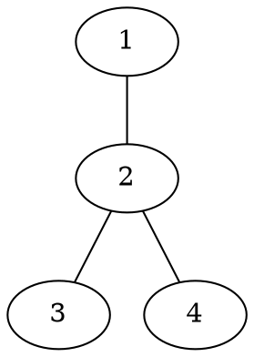
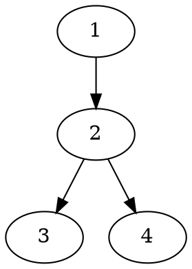
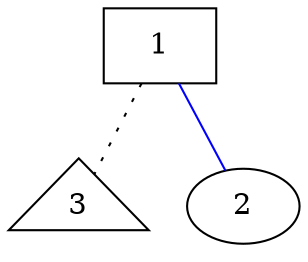
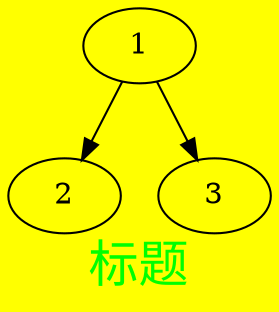
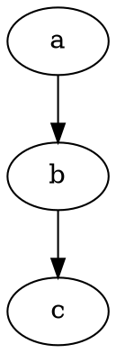
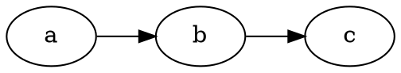
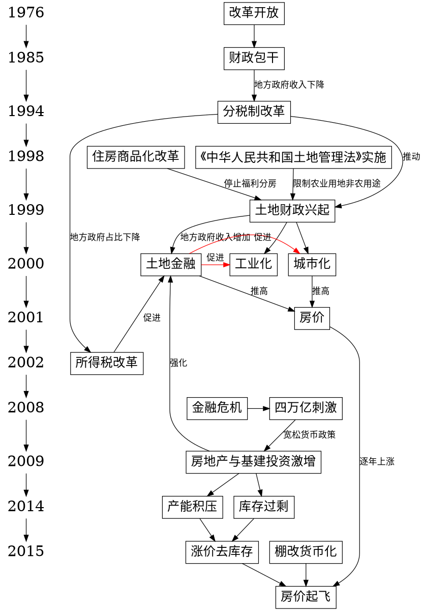
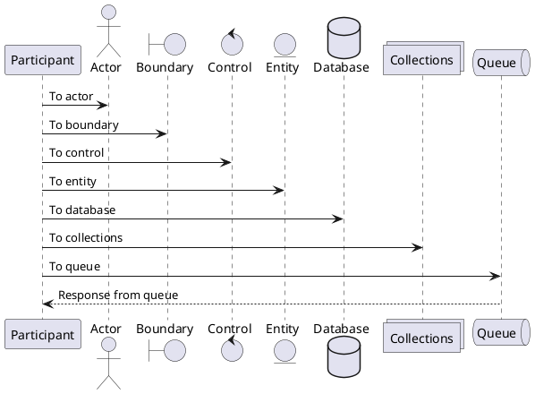
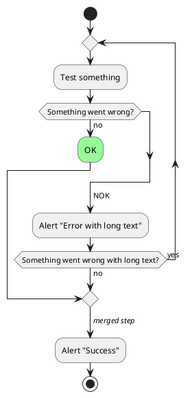

+++
title = "我的画图流：画图工具与技巧分享"
date = 2023-01-30T19:22:00-08:00
lastmod = 2025-01-09T17:44:07-08:00
tags = ["tool"]
categories = ["工作流"]
draft = false
toc = true
+++

## <span class="section-num">1</span> 前言 {#前言}

古人云：「一图胜千言」。
一幅合适的图片可以清晰地向读者表达我们的意图，又因为我们人脑的作用机制，阅读一张图片所耗费的脑力要远少于一段文字，故而我们对图片更加深刻。

古人又云，「工欲善其事，必先利其器」，那么我就来分享一下我使用得顺手的画图工具与画图技巧。


## <span class="section-num">2</span> excalidraw {#excalidraw}

[excalidraw](https://excalidraw.com/) 是我最常用的画图工具，是一款开源的手绘画风的画板工具，图形风格是简洁而精美，一经使用，便爱不释手。

非常适合构建原型或阐述想法

我见证它在Github上的star数从10k涨至现在的40k，表明众多用户对它的喜爱。

excalidraw提供了基本的图形，如矩形，图形，菱形，文本，箭头等，稍经组合，就可以绘制很精美，简洁的图画。


### <span class="section-num">2.1</span> 涂鸦之作 {#涂鸦之作}

Hadoop 词频计算:



数据治理:



数据未分层:



数据分层:



因为excalidraw 相当的灵活，甚至系统循环图我都是使用它来绘制的：

系统循环图:




### <span class="section-num">2.2</span> 素材库 {#素材库}

如果基本的图形无法满足诉求的话，excalidraw 还提供了在线[library](https://libraries.excalidraw.com/?theme=light&sort=default)，供设计师把他们的图形，图标分享给其他用户。例如系统架构图，AWS组件图，UML图，手绘人物图等等，应有尽有，不一而足。

素材库:



(商户系统的头像就是引用自 library)


### <span class="section-num">2.3</span> 在线协作 {#在线协作}

excalidraw 还支持端对端加密的在线协作，只需要将一个链接发送给协议方，就能实现画图在线协作：

```txt
https://excalidraw.com/#room=91bd46ae3aa84dff9d20,pfLqgEoY1c2ioq8LmGwsFA
```

在远程会议，需要多方画图协作沟通的时候非常有用。


### <span class="section-num">2.4</span> 技巧分享 {#技巧分享}

excalidraw 画曲线的技巧

1.  按住Control/Command, 然后双击线条，进入曲线编辑模式
2.  然后拖动线条，使用Control/Command + D 在末尾增加一个端点，或者使用删除键删除一个端点（留意excalidraw 工具栏下方的操作提示）

绘制曲线:



我在拙作[《我的写作流》](https://mp.weixin.qq.com/s/mid3TpmXJMM7xWm5rfl7qg)中提到过，我倾向「本地化」+ 「文本化」 + 「版本管理」 + 「云同步」的知识管理文案，对于图片管理，我也是类似的倾向。

因为图片是二进制流，无法做版本管理，所以我一般会把excalidraw 文件保存到本地，保存成xxx.excalidraw 的文件，实际是Json 文本；然后再导出成png, svg 等各种形式的图片文件。

如果需要修改图片或者复制，剪切，只需要导入xxx.excalidraw，修改保存成新的excalidraw 文件，即可以实现「版本管理」



原来excalidraw 有个限制，就是一次只能编辑一个excalidraw 文件，经@qisdreamyan 提醒，Vscode的[excalidraw 插件](https://marketplace.visualstudio.com/items?itemName=pomdtr.excalidraw-editor)支持直接在Vscode 里面编辑excalidraw 文件，那么就可以同时编辑多个文件啦。



目前excalidraw 美中不足的一点就是，不支持手绘风格的非拉丁文字体，如中文，日文字体等，很早之前就有[issue](https://github.com/excalidraw/excalidraw/pull/5604)在谈论了，目前还没有什么进展。


## <span class="section-num">3</span> graphviz {#graphviz}

我主要是用graphviz 来绘制复杂的关系图，timeline图。
它系出名门，出自大名鼎鼎的的AT&amp;T实验室，类似微软出的「Visio」，但两者有个本质的差别。

就是「Visio」是手动的，需要绘图者指定点线之间的布局，而graphviz 是自动布局的，只要将告知graphviz点与线的关系，graphviz 就能实现「自动布局」。

如果是绘制简单的布局的图表，「自动布局」与「手动布局」差别不大。

但如果是绘制复杂的图画，「手动布局」不仅繁琐，还不美观，而「自动布局」都能帮我们轻松搞定，为我们节省非常多的精力。

不看广告，看疗效，来看下我使用graphviz 画出的图：

土地财政时间线:



西方哲学史演进历程:



Graphviz 官方示例库：

Unix 家谱:



数据结构:



更多更复杂的示例，可见官方的[gallery](http://www.graphviz.org/gallery/)


### <span class="section-num">3.1</span> 快速入门 {#快速入门}

graphviz 使用所谓的「dot 语言(language)」这种标记语言来描述图形，然后再由命令行生成图片。

程序员们可以把这个理解成，从源码编译到可执行文件。


#### <span class="section-num">3.1.1</span> 有向图 (digraph)与无向图 (graph) {#有向图--digraph--与无向图--graph}

dot语言支持两种图形，分别是有向图 (digraph)与无向图(graph).

定义一个无向图





定义一个有向图：





命名规范与C家族的编程语言类似：图形关系定义在花括号={}= 中；每条语句以 `;` 结尾; `//` 表示单行注释, =/\*\*/=表示多行注释


#### <span class="section-num">3.1.2</span> 节点(node) {#节点--node}

`mydigraph` 是图形名，=1=, `2` 是节点名(node), 两个节点构成一条边(edge)。在图的定义中，相同的名称就代表同一个节点。

当dot 编译器遇到一个新的名称，就认为是新的节点


#### <span class="section-num">3.1.3</span> 属性(property) {#属性--property}

属性可以设置在节点和边上，通过「方括号 =[]=」来定义属性，属性之间用英文逗号分隔。

属性的定义采用如下的格式：

```txt
属性名 = 属性值
```

常见的属性有：

-   label: 标题
-   color: 颜色
-   style: 样式
-   shape: 形状

<!--listend-->





属性还可以作用于图(graph)上，常用的属性包括:

-   label:标题
-   bgcolor:颜色
-   fontname:字体名称（【不】影响节点和连线）
-   fontsize:字体大小（【不】影响节点和连线）
-   fontcolor:字体颜色（【不】影响节点和连线）
-   center:是否居中绘制

<!--listend-->





更多的属性可见官网：[Attributes](http://www.graphviz.org/doc/info/attrs.html)


#### <span class="section-num">3.1.4</span> 子图(subgraph) {#子图--subgraph}

subgraph 的作用主要有 3 个：

-   表示图的结构，对节点和边进行分组
-   提供一个单独的上下文设置属性（类似操作系统里面不同的线程，有不同的线程变量）
-   针对特定引擎使用特殊的布局。比如下面的例子，如果 subgraph 的名字以 cluster 开头，所有属于这个子图的节点会用一个矩形和其他节点分开。
    ```dot
    digraph graphname{
    a -> {b c};
    c -> e;
    b -> d;

    subgraph cluster_bc {
    bgcolor=red;
    b;
    c;
    }

    subgraph cluster_de {
    label="Block"
    d;
    e;
    }
    }
    ```
    


#### <span class="section-num">3.1.5</span> 图布局(layout) {#图布局--layout}

默认情况下图是从上到下布局的(rankdir `"TB")，通过设置 rankdir`"LR" 可以让图从左到右布局。

默认布局(From top to bottom)





From Left to right:





该属性只针对图(graph)生效.


#### <span class="section-num">3.1.6</span> 示例 {#示例}

再回头看下，「土地财政时间线」这图的源代码：




#### <span class="section-num">3.1.7</span> 编辑器支持 {#编辑器支持}

如果是Emacs 用户，可以使用[graphviz-dot-mode](https://github.com/ppareit/graphviz-dot-mode) 来编辑并预览生成的图片，效果如下：



虽然我是重度Emacs 用户，但是在Emacs上实时预览图片效果并不好。

Emacs对查看图片功能支持不够强大，无法通过鼠标放大缩小，并实时预览图片。

如果需要实时预览graphviz 生成的图片，我个人更加推荐使用Vscode + [graphviz 插件](https://marketplace.visualstudio.com/items?itemName=joaompinto.vscode-graphviz) ：




## <span class="section-num">4</span> plantuml {#plantuml}

身为程序员，免不了撰写各种设计方案，绘制各种序列图，类图，活动图，状态机图等等各种UML图。

而[plantuml](https://plantuml.com/) 就是这样一个绘图组件，支持绘制各种程序开发需要用到的图。

plantuml 依赖的底层组件就有前文提到的graphviz，所以plantuml的语法也类似graphviz, 通过自定义的标记语言，来描述不同图形之间的关系，「自动布局」并绘制。

学过UML规范的同学应该都知道这些图应该怎么画，我就拿几个常见的图来举个例子。


### <span class="section-num">4.1</span> 时序图 {#时序图}

plantuml 提供不同的组件供时序图使用。不同的组件有不同的形状，默认情况下，组件的声明顺序就是他们的展示顺序。

使用=-&gt;= 来表示在两个组件/参与者(participant) 之间传递消息，=&lt;--= 表示回包信息。





时序图的更多用法可见官网文档：[Sequence-Diagram](https://plantuml.com/sequence-diagram)


### <span class="section-num">4.2</span> 活动图 {#活动图}






### <span class="section-num">4.3</span> 编辑器 {#编辑器}

如果需要实时预览，个人推荐Vscode + [plantuml插件](https://marketplace.visualstudio.com/items?itemName=jebbs.plantuml)来绘制plantuml 图，所见即所得，实时预览，并提供代码补全：




## <span class="section-num">5</span> matplotlib {#matplotlib}

这就是个绘图库了，主要是用来绘制各种图表，比如折线图，饼图，直方图等，通常是配合数据分析使用，还支持xkcd 风格。

之前在上MIT 6.00网课的时候，John Guttag教授出了一个概率统计题，一个醉汉每次向四个方向中任意一个方向走一步，500步后，醉汉是离原点越来越近呢，还是越来越远？

下面是Python代码实现，模拟醉汉行为：

```python
# 运行下面代码前，确保依赖已安装
# pip3 install matplotlib --user
import math, random
import matplotlib.pyplot as plt
plt.xkcd()

class Location(object):
    def __init__(self, x, y):
        self.x = float(x)
        self.y = float(y)

    def move(self, xc, yc):
        return Location(self.x + float(xc), self.y + float(yc))

    def getCoords(self):
        return self.x, self.y

    def getDist(self, other):
        ox, oy = other.getCoords()
        xDist = self.x - ox
        yDist = self.y - oy
        return math.sqrt(xDist**2 + yDist **2)

class CompassPt(object):
    possibles = ('N', 'S', 'E', 'W')
    def __init__(self, pt):
        if pt in self.possibles:
            self.pt = pt
        else:
            raise ValueError("in CompassPt.__init__")

    def move(self, dist):
        if self.pt == "N":
            return (0, dist)
        elif self.pt == "S":
            return (0, -dist)
        elif self.pt ==  "E":
            return (dist, 0)
        elif self.pt == "W":
            return (-dist, 0)
        else:
            raise ValueError("in CompassPt.move")

class Field(object):
    def __init__(self, drunk, loc):
        self.drunk = drunk
        self.loc = loc

    def move(self, cp, dist):
        oldLoc = self.loc
        xc, yc = cp.move(dist)
        self.loc = oldLoc.move(xc,yc)

    def getLoc(self):
        return self.loc

    def getDrunk(self):
        return self.drunk


class Drunk(object):
    def __init__(self, name):
        self.name = name

    def move(self, field, time = 1):
        if field.getDrunk() != self:
            raise ValueError("Drunk.move called with drunk not in field")

        for i in range(time):
            pt = CompassPt(random.choice(CompassPt.possibles))
            field.move(pt, 1)

def performTrial(time,f ):
    start = f.getLoc()
    distances = [0.0]
    for t in range(1, time+1):
        f.getDrunk().move(f)
        newLoc = f.getLoc()
        distance = newLoc.getDist(start)
        distances.append(distance)
    return distances

def firstTest():
    drunk= Drunk("Homser Simpson")
    for i in range(5):
        f = Field(drunk, Location(0, 0))
        distances = performTrial(500, f)
        plt.plot(distances)
        plt.title("Homer's random Walk")
        plt.xlabel("Time")
        plt.ylabel("Distance from origin")
        fname = "images/mit6.00/simulation_random_walk_trail1.png"
        plt.savefig(fname)
    return fname

return firstTest()
```

模拟5次，生成出来的[xkcd](https://xkcd.com/)风格的图表：




### <span class="section-num">5.1</span> 再话org-mode {#再话org-mode}

在[《我的写作流》](https://mp.weixin.qq.com/s/mid3TpmXJMM7xWm5rfl7qg)里面，我有提到过，我使用Emacs + org-mode 来编写文章，对比markdown 或者其他的标记语言，=org-mode= 有一个巨大的优势，就是=org-mode= 借助内置的[`org-babel`](https://orgmode.org/worg/org-contrib/babel/) 组件，可以直接运行代码。

在markdown 里面，下面的代码块的用处仅仅是语法高亮：

````markdown
```python
print("helloworld")
```
````

但在 `org-mode`, 下面的代码块是可运行的，我只要在Emacs中按下=C-c C-c=，就会运行代码，并输出=helloword=。

````org
#+begin_src python
  print("helloworld")
#+end_src
````

看起来作用不大，但是和 `graphviz`, `plantuml`, `matplotlib` 结合，就会产生无穷的威力：\*\*只要我把绘图源码写好，然后再按下 =C-c C-c=，就能自动生成图片，并自动插入到当前这篇文章中(当然，如果代码写错了，是编译生成不出图片的)\*\*。

根本不需要手动编译，生成图片，然后再把图片以markdown格式手动插入: `` 。

上面的概率统计模拟图也是这样生成出来的，写好Python 代码，然后按下 `C-c C-c`

一切都浑然天成。


## <span class="section-num">6</span> 那些年，我使用过的绘图工具 {#那些年-我使用过的绘图工具}

都是曾经使用过，现在也基本弃用的工具：

-   Word：最开始时也不知道什么画图工具，就使用Word 来画图。
-   PPT：写技术方案基本不用了，画PPT做分享和述职，就还只能继续使用。
-   drawio: 功能丰富，但图形有种说不出的丑，并且绘制起来不顺手
-   processon: 在线绘图服务，免费版本有绘画张数限制（不记得是10张还是15张）;对于Saas服务而言，数据不属于用户。公司倒闭或限制用户，就有丢失数据风险。

图表与文章一样，都是资产。

对于这样的重要资产，我还是倾向于「本地化」+ 「文本化」+ 「版本管理」+ 「云同步」的方案，保证图表既易于修改，又无丢失风险。


## <span class="section-num">7</span> 结语 {#结语}

金庸笔下的「独孤求败」的用剑之道：「四十岁后，不滞于物，草木竹石均可为剑。自此精修，渐进于无剑胜有剑之境」

excalidraw, graphviz 也好， plantuml, org-mode 也罢，只是「器」，都只是用来表达想法与智慧的工具。

所谓「飞花摘叶皆可伤人，草木竹石均可为剑」，真正的大牛，即使不使用画图工具，寥寥数语就会把一个复杂的概念解释得清楚明了。

厚积而薄发，选择合适的「剑」很重要，但「内功」的修炼同样重要。


## <span class="section-num">8</span> 参考 {#参考}

-   [Graphviz Documentation](https://graphviz.org/documentation/)
-   [Graphviz 入门指南](https://zhuanlan.zhihu.com/p/21993254)
-   [【自动】绘图工具 Graphviz](https://program-think.blogspot.com/2016/02/opensource-review-graphviz.html)

<div center class="qr-container">

公号同步更新，欢迎关注👻
</div>

